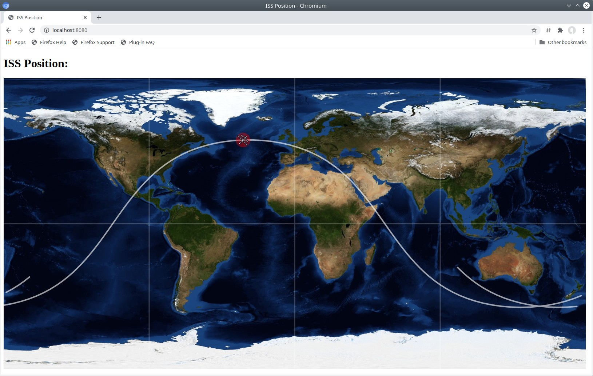

# issposition
A simple web app that shows the position of the international space station (ISS):



TLEs are downloaded from [Celestrak](www.celestrak.com) when the application is started. The image is generated on the server, the page refreshes it every two seconds.

This is just a fun project I decided to do after reading *Diary of an Apprentice Astronaut* by *Samantha Cristoforetti*. Rendering the map on the server every two seconds is quite inefficient and some features are missing, e.g. reloading the TLE file periodically.

A lot more information about the ISS, its orbit, at what time it can be seen in the sky can be found on the Heavens-Above [webpage](https://www.heavens-above.com/).

## Usage

The default port is `8080`. A different port can be specified on the command line, e.g.

```bash
$ ./issposition 1234
```

## Attribution

ISS icon made by [Freepik](https://www.freepik.com) from [Flaticon](https://www.flaticon.com)
